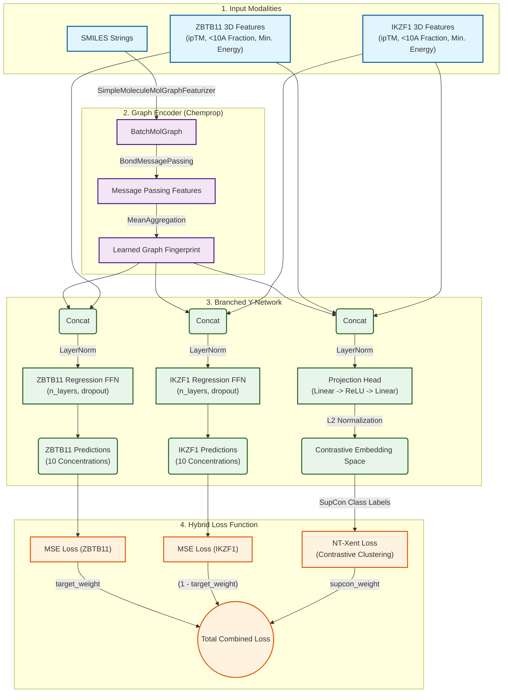

# A Sticky Situation: Using Machine Learning to Design Selective Molecular Glues
## 📌 Project Summary
This project presents an advanced computational pipeline to predict the dose-curve degradation profiles and target selectivity of Molecular Glue Degraders (MGDs). By integrating 2D chemical representations (SMILES) with 3D structural thermodynamics (RoseTTAFold 3 & OpenMM), we developed a custom Branched Graph Neural Network (MPNN) using Chemprop v2. The model features a hybrid Supervised Contrastive Learning (SupCon) loss function designed to predict the abundance of two therapeutic neosubstrates (ZBTB11 and IKZF1) across 10 different dosage concentrations, ultimately allowing us to identify highly selective MGDs and extract their defining structural motifs via atom-level saliency maps.

## 🧬 Biological Problem & Motivation
Molecular glue degraders (MGDs) are small molecules that induce proximity between an E3 ubiquitin ligase (such as CRBN) and a target protein (neosubstrate), leading to the target's ubiquitination and subsequent proteasomal degradation. While MGDs offer a powerful mechanism to target "undruggable" proteins, achieving precise target selectivity is a major challenge.

In this study, we focus on ZBTB11 (the primary on-target) and IKZF1 (a commonly observed off-target of MGDs). Unintended degradation of off-target neosubstrates can lead to unintended cellular consequences and severe dose-limiting toxicities in the clinic. Thus, developing a machine learning model capable of predicting the selectivity profile of novel MGDs in silico would accelerate the rational design of safer, highly targeted therapeutics and would reduce reliance on expensive empirical synthesis and screening.

## 📊 Data Sources
The dataset pairs experimental degradation assays with computationally derived structural features:

**Experimental Data:** DMSO-normalized protein abundance values (%) for ZBTB11 and IKZF1 across 10 distinct MGD concentrations (ranging from 3 nM to 100 μM).

**2D Chemical Features:** Compound SMILES strings to generate molecular graphs and Morgan fingerprints.

**3D Structural Thermodynamics:** Features extracted from CRBN:MGD:Neosubstrate ternary complex modeling, including:
* ipTM scores from RoseTTAFold 3.
* Fraction of successful binding poses (complexes under 10Å).
* OpenMM minimized complex energies (kJ/mol).

## 💻 Computational Approach & Workflow
To predict full degradation concentration curves, we employed a dual-track machine learning approach:
    
**Baseline Classical Model:** Ridge Regression (L2 regularization) with 5-fold cross-validation, utilizing 2048-bit Morgan Fingerprints concatenated with scaled 3D thermodynamic features.

**Advanced Deep Learning Model (Chemprop Branched MPNN):** 
* Message Passing Neural Network (MPNN): Extracts learned representations directly from the 2D molecular graph.
* Branched Y-Network Architecture: The learned graph embedding and 3D features are split into two independent, target-specific Feed-Forward Networks (FFNs)—one dedicated to ZBTB11 and one to IKZF1.
* Hybrid Loss Function: Combines a target-weighted Mean Squared Error (MSE) loss for regression with a Normalized Temperature-scaled Cross Entropy (NT-Xent) Supervised Contrastive loss to spatially separate selective vs. unselective compounds in the latent space.
* Hyperparameter Tuning: Automated via Optuna (Hyperband Pruning) to optimize network depth, dropout, learning rate, and loss weights.

## 🛤️ Route Design & Execution
### Model Architecture

### 1. **Data Preprocessing, Splitting, and Inspection:** 
Splitting by Bemis-Murcko chemical scaffolds is used to divide the data into 80/10/10 (Train/Val/Test) splits to ensure the model's ability to generalize to novel chemotypes. Target AUCs (Area Under the Curve) are calculated using trapezoidal integration. Distribution and correlation of the target AUCs are analyzed and plotted to inform definition of appropriate parameters for Optuna tuning.

### 2. **Model Training:** 
20 independent Ridge models (1 per concentration/target) are trained as baselines. Optimal parameters for the unified Branched MPNN are identified through 200 Optuna trials. The final MPNN model is then trained over a minimum of 150 epochs. Appropriate early-stopping and pruning callbacks are implemented to save GPU compute time on poor trajectories during Optuna tuning and final model training.

### 3. **Selectivity Calculation:** 
Model predictions across the 10 concentrations were integrated into an AUC. Selectivity was defined as the differential between the predicted IKZF1 AUC and ZBTB11 AUC.

### 4. **Latent Space Analysis:** 
UMAP was utilized to visualize the clustering of compounds based on the Morgan fingerprints from the Ridge Regression model or the hidden embeddings extracted from the MPNN.

### 5. **Interpretability:** 
Gradient-based backpropagation was used to generate Atom-Level Saliency Maps, highlighting the specific structural moieties driving the network's abundance predictions for ZBTB11 and IKZF1.

## 📈 Results Summary
**Performance:** The deep learning model successfully captures non-linear degradation dynamics, showing improved RMSE and Pearson correlation scores across the concentration gradient compared to the Ridge baseline. Notably, it predicts the IKZF1 abundance levels with significantly greater accuracy than the Ridge model.

**Latent Space:** UMAP visualizations of the MPNN embeddings reveal distinct chemical space clustering of dual-degraders versus IKZF1-selective compounds, validating the effectiveness of the contrastive loss function.

**Saliency Maps:** Feature attribution mapping on the ground-truth top 10 ZBTB11- and IKZF1-selective compounds provides visual confirmation of the network's learned chemistry. The maps successfully highlight linker vectors as the most important features for predicting target-selective degradation and identify specific glutarimide positions known to alter ternary complex formation.

## 🔍 Conclusions (from iterative model building)
**Observations:**
* The integration of 3D thermodynamic features alongside 2D graph properties significantly improves the model's ability to reason about steric clashes and ternary complex stability, proving that static structural proxies carry valuable signal for degradation prediction.
* Shifting the training/validation/testing split from 0.8/0.1/0.1 to 0.7/0.15/0.15 (and decreasing training set size further!) significantly degrades the predictive accuracy of the model, indicating that the model is likely starved of and would benefit from more training data.
* ZBTB11 distribution in the experimental dataset is heavily skewed toward a massive spike on the right side (high AUC = high abundance = low/no degradation). It acts almost like a binary switch: compounds either degrade it or they don't. Meanwhile, the IKZF1 distribution is a much flatter, continuous curve spanning the entire AUC range. It is mathematically harder for the neural network to fit a broad curve than a cliff, making it necessary to give more attention to IKZF1 than ZBTB11 for training and accurate predictions. This explains why prioritizing MSE loss on IKZF1 (decreasing 'target_weight') significantly improves predictive accuracy on IKZF1 abundances without significantly degrading the accuracy on ZBTB11 abundances.
* An r = 0.671 shows a strong positive correlation between ZBTB11 and IKZf1. Because they are biologically linked, forcing the model to learn the difficult, nuanced chemical rules of IKZF1 inherently hands it the features it needs to solve ZBTB11.

**Limitations:**
* Because we are predicting full dose-curves and not just summary statistics (e.g. pDC50, Dmax, Dconc), we are somewhat limited in the data we can incorporate from published literature. This is because the ZBTB11 primary target is relatively novel, and few groups have studied the target or examined its potential as a therapeutic target for degradation strategies. Furthermore, whole-cell proteomics datasets that detect ZBTB11 abundance would not provide us with the full dose-curve data we need as inputs, making it necessary to run further experiments to collect more data.
* The ternary complex structures are generated by RoseTTAFold 3 and not experimentally determined, so any erroneous complexes are still minimized and scored. Down the pipeline, these features will propagate into the training of the model as three separate features (e.g. ipTM, ratio of successful complexes, minimized energy), poisoning the model with bad or unrepresentative/uncorrelative weights.

**Next Steps:** 
* Are there other protein substrates that are promiscuously recruited by MGDs for degradation across varying potencies (similar to IKZf1)? Other proteins that show more "switch-like" degradability by MGDs (like ZBTB11)? Do these two distinct groups share features within their degradability grouping? What are the features that distinguish the two groups from each other?
* Expand the dataset with novel MGD chemotypes to improve generalizability.
* Implement a subtraction-based saliency map (ZBTB11 gradients minus IKZF1 gradients) to directly visualize atoms driving divergent selectivity.
* Could use the model (and trained model weights) to predict ZBTB11 and IKZF1 degradation by published molecular glues. This would be followed by ordering said MGD and experimentally validating these predictions (and using the data to train the model further!)

## ⚙️ Reproducibility Instructions

To run this analysis locally, ensure you have Python 3.12 installed (**IMPORTANT:** the many packages used in this pipeline have dependencies that are intercompatible on **ONLY Python 3.12**) and set up the following environment:

### 1. Clone the repository
    git clone https://github.com/yourusername/mgd-selectivity-predictor.git
    cd mgd-selectivity-predictor

### 2. Create and activate a virtual environment
    conda create -n mgd_env python=3.12
    conda activate mgd_env

### 3. Install required packages
    pip install pandas numpy scikit-learn rdkit seaborn matplotlib optuna
    pip install torch torchvision torchaudio --index-url https://download.pytorch.org/whl/cu[your CUDA version]
    pip install chemprop pytorch-lightning umap-learn astartes

### 4. Running the pipeline
**WARNING: PIPELINE REQUIRES DEDICATED GPU COMPUTE RESOURCES**

Open the provided Jupyter Notebook (model7.ipynb) in your preferred environment (Jupyter Lab, VSCode, etc.). Ensure the input data files (zbtb11_mgd_input.csv, rf3_features_with_thermodynamics_*.csv) are located in the root directory. Execute the notebook sequentially from top to bottom.

## 📁 Repository Artifacts
### 📓 Notebook: 
* model7.ipynb - The complete pipeline from data loading to saliency generation.

### 📄 Input Data:
  * zbtb11_mgd_input.csv - The input dataset containing columns: 'Molecule', 'SMILES', and 20 columns of the concentration-specific target abundances.
  * rf3_features_with_thermodynamics_zbtb11.csv - ZBTB11-specific features modeled and computed by RoseTTAFold 3 and OpenMM/OpenFF. Contains columns: 'Compound_ID', 'SMILES', 'Seed', 'ipTM_zbtb11', 'pTM_zbtb11',	'pLDDT_zbtb11', 'Ranking_Score_zbtb11',	'Early_Stopped_zbtb11',	'Min_Dist_Angstrom_zbtb11',	'Dist_Status_zbtb11',	'Flagged_Greater_Than_10A_zbtb11', 'Fraction_Success_Under_10A_zbtb11', 'OpenMM_Minimized_Energy_kJ_mol_zbtb11'
  * rf3_features_with_thermodynamics_ikzf1.csv - IKZF1-specific features modeled and computed by RoseTTAFold 3 and OpenMM/OpenFF. Contains columns: 'Compound_ID', 'SMILES', 'Seed', 'ipTM_ikzf1', 'pTM_ikzf1',	'pLDDT_ikzf1', 'Ranking_Score_ikzf1',	'Early_Stopped_ikzf1',	'Min_Dist_Angstrom_ikzf1',	'Dist_Status_ikzf1',	'Flagged_Greater_Than_10A_ikzf1', 'Fraction_Success_Under_10A_ikzf1', 'OpenMM_Minimized_Energy_kJ_mol_ikzf1'

### 📊 Outputs:
* zbtb11_mgd_auc_labels_input.csv (Input labeled with calculated AUC values)
* zbtb11_mgd_ridge_output.csv & zbtb11_mgd_chemprop_output.csv (Full test set predictions)
* zbtb11_mgd_ridge_metrics.csv & zbtb11_mgd_chemprop_metrics.csv (regression metrics computed for all concentration-specific abundances)
* data_checks.png (Distribution and correlation analysis of the target AUCs)
* *_umap.png (Chemical space visualization)
* learning_curves.png (Training and validation loss visualization)
* top_10_zbtb11_saliency_grid.png & top_10_ikzf1_saliency_grid.png (Feature attribution maps)
